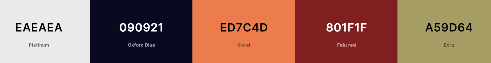
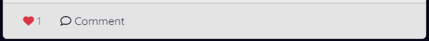
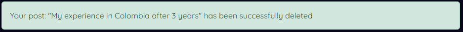
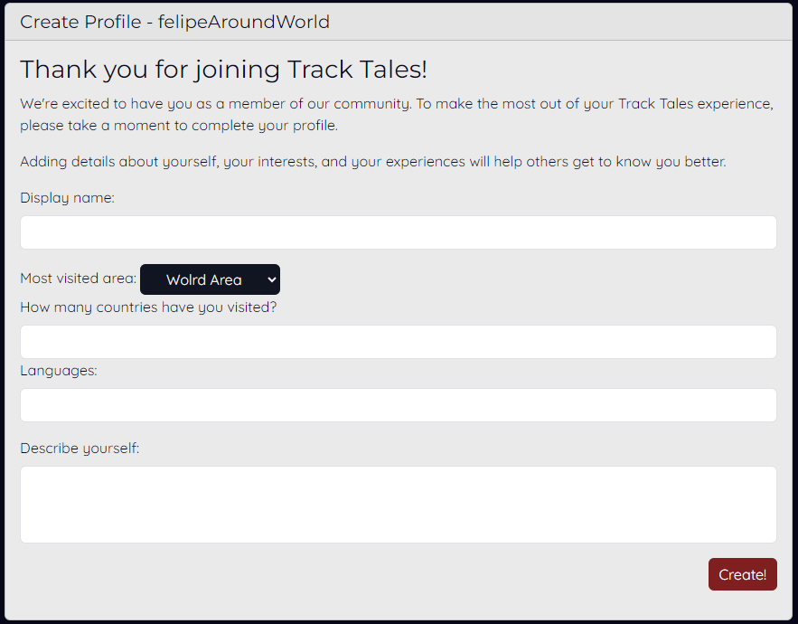
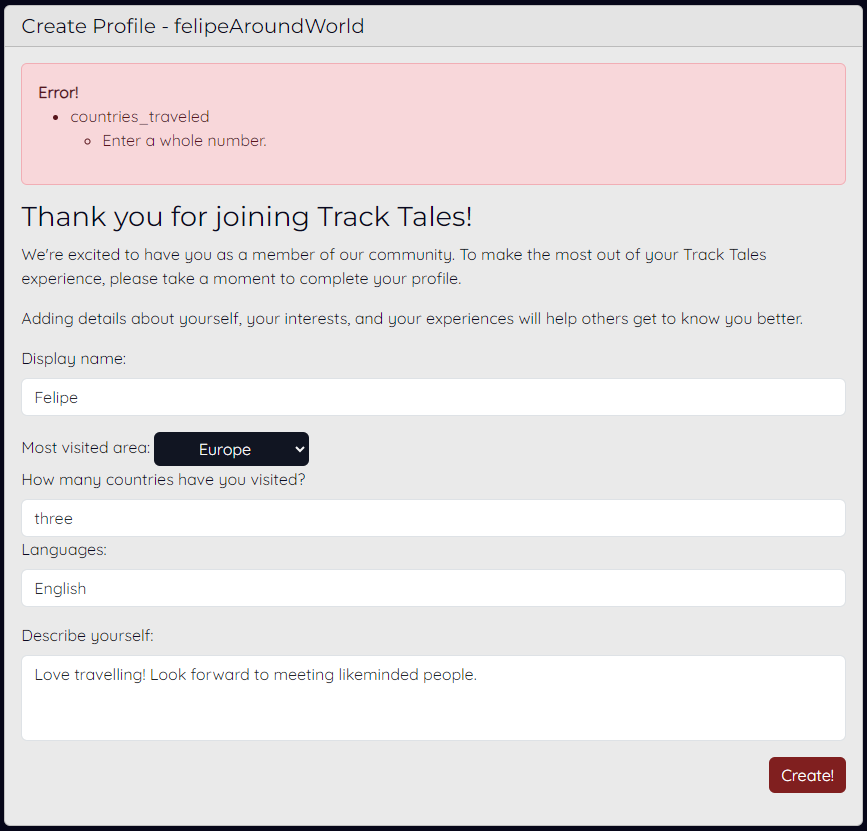
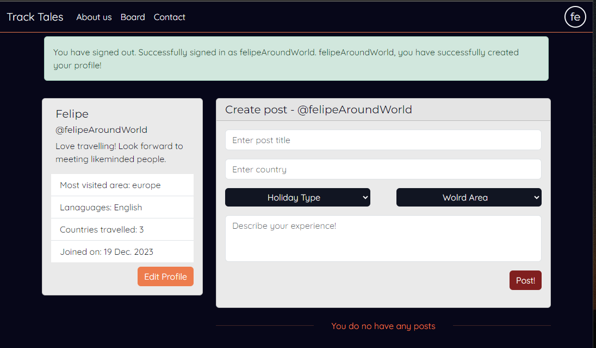
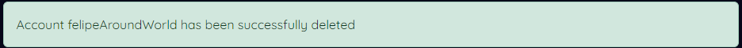

# Track Tales Community

#### /input responsive screenshot/

Explore Track Tales, a thoughtfully designed platform for seamless storytelling. Create posts with titles, rich content, and holiday tags. Personalize your profile, adding a unique touch, while geographical tags provide a global context. Interact seamlessly with likes and comments, fostering a sense of community. Join us in the beautifully crafted space of Track Tales and effortlessly share your stories.

The TrackTales community is live, to access it [click here.][ADD LINK]

## Table of contents

+ [UX](#ux)
+ [Design](#design)
+ [Features](#features)
+ [Testing](#testing)
+ [Technologies used](#technologies-used)
+ [Deployment](#deployment)
+ [Credits](#credits)

## UX

### Site Purpose
Track Tales serves as a dedicated space for individuals passionate about travel to freely share their stories. Our platform is designed to empower users, allowing them to create personalized profiles, seamlessly publish travel narratives, and engage with a community of like-minded travelers.

### Audience

Track Tales caters to travel enthusiasts and storytellers alike, providing a dedicated space for individuals passionate about sharing their unique travel experiences. This platform fosters connections among like-minded individuals who appreciate the beauty of diverse narratives from around the world, creating a vibrant community for bloggers and writers focused on the art of travel storytelling.

### Current User Goals

- Learn about the community
- Send questions to the community administrators
- Create travel posts
- See posts
- Edit posts
- Delete posts
- Filter exisitng posts
- Comment on posts
- Like/dislike posts
- Edit their profile
- Delete their profile


### Future User Goals

- Learn about the community
- Send questions to the community administrators
- Create travel posts 
- See posts
- Edit posts
- Delete posts
- Filter exisitng posts
- Comment on posts
- Like/dislike posts
- Create their profile
- Edit their profile
- Delete their profile

## Design

### Color scheme

The color scheme of the website was deliberately selected to create a dark background where other elements can pop out. The primary colors were platinum and oxford blue to provide a clear contrast, and the main accent color is coral, as it contrasts highly with the oxford blue. The Falu red and Ecru colors were used in buttons where the background was clearer to create a higher contrast. This careful selection of colors contributed to a visually appealing and cohesive design throughout the website



### Typography

The body of the elements on the website utilized the font Quicksand, while the headings were complemented by Montserrat. This careful selection of fonts enhances the professional appearance of the engineering site.

### Imagery

The three hero images were obtained from a free stock photo platform to capture attention regarding the main purpose of the web application: travel.

## Features

### Existing Features

#### Navbar

- On large screens, the navbar displays links to Home, About Us, Board, Contact, and User Options. 


- When the user is not logged in, a user icon is displayed, and the options are sign-up or login.


- When the user is logged in, the first two letters of the user's username are displayed instead of the profile icon, and the options are Profile or Logout.


- In small screens, all links except the Home link are placed within a burger menu. Additionally, the profile dropdown options are added in the same category as the rest of the links. 


#### Footer

- Users have functional links to X, Instagram, and YouTube. These links will open in a new tab as they are outside the web application. 


#### Index

- Three carousel images are displayed on the home page. 
- The initial page contains catchy titles and functional links to the posts board and About Us pages.


- The second page encourages users to create an account and provides links to sign-up or login.

add screenshot

- The third page provides a brief background about the application and offers a link to "Learn More," redirecting to the About Us page. Additionally, there is a "Contact Us" link that directs users to the contact form. 

add screenshot

#### About us 

- This is an informational page that includes a brief description of the forum, explains what a user can do on the platform, and features catchy content at the end. Additionally, it provides buttons to redirect the user to the posts board and to sign up.


#### Contact

- This page contains a form for a user to directly contact the admin. The fields include first name, last name, email, phone number, subject, and message. 


- If the form is invalid, error messages will be displayed. 


- If the form is successfully submitted, it will redirect the user to a success landing page where they have buttons to go back home. If they are not authenticated, they can sign up. 


#### Board 

- Post Creation Form: This is where users can create a post. They can enter a title, country, choose from dropdowns for holiday type and world area, and provide the content of the experience.  


- All posts need to be approved; therefore, after a post is successfully submitted, a success message is displayed, stating that the post has been received and is awaiting approval.


- When a user is not authenticated, they cannot create posts. Therefore, instead of displaying the create post form, a card is shown explaining that they need to have an account to create posts.


- All approved posts are displayed on the board page. A post is comprised of the user who wrote it, the time since the post was created, post title, holiday type, location, country, and content.


- Additionally, the post have 3-4 buttons: 
    - The post author is a link that redirects the user to the author's profile. 

    

    - The like button changes appearance; when a post is unliked, it shows an empty heart, and when liked, it displays a solid heart. Additionally, it increases or decreases the like count.

    

    

    - The comment button is a toggle button that reveals a text area for users to comment on the post.

    

    - When the user is not authenticated, they cannot like or comment on a post. In this case, both buttons work as toggles to display a message that the user needs to have an account to like or comment on a post.

    

    - Options Button: This button is only displayed in posts where the authenticated user is the author of the post. The options button is a dropdown menu that presents two choices: edit post and delete post.

    

- Comment Submission: All comments need to be approved by the admin. Therefore, after a comment is submitted, a success message is displayed, indicating that the comment is awaiting approval.


- Displayed Comments: After comments have been approved, they are shown below the post, indicating the author and the time since the comment was made. The username is also a link to the user's profile.


- Edit Post: When the authenticated user wants to edit their post, a modal with the edit post form is displayed.


- As the content needs to be reviewed, a success message is displayed when a post has been edited, indicating that it is awaiting approval.


- After the edited post is approved, an '(edited)' text is added in italics below the main content of the post to indicate that it has been edited.


- Delete Post: When the authenticated user clicks on the delete post option, the delete post modal is displayed, asking the user for confirmation if they want to delete the post with the specific title.


- When the post is deleted, a success message is displayed, indicating that the post has been deleted.



- Filter Posts: On large screens, the filter post card is displayed on the left-hand side and is stuck to the top of the page. The user can filter posts based on the world area or holiday type. The card includes a clear filter button to remove all selected filters and an apply filters button to activate the chosen filters, reload the page, and display only the posts with the selected filters.


- In smaller screens, the filter card is not displayed. Instead, a small button is placed between the create post form and the posts.


- When clicked, the filter button will open the filter card as a modal, allowing the user to successfully filter posts on small screens.


#### Registration (Authentication)

- When not authenticated, users can create an account using a unique username and password.


- When the user attempts to create an account with an existing username, a password that does not fulfill the requirements, or if the passwords do not match, an error is displayed in the form.


- Login Page: A user can log in to the application by inputting their username and correct password.


- If, when logging in, the user inputs an incorrect username or password, the form will display the error.


- Logout Page: Here, the application asks the user for confirmation before logging out. 


#### Create profile 

- After a user signs in for the first time, they are redirected to the create profile page. This page does not contain navigation links, as its purpose is to encourage the user to complete their profile.



- The create profile form has form validation features and displays errors if a field is left blank or filled incorrectly.



- If the form is valid, the user is redirected to their user profile page, where they see a success message stating that their profile has been created. 



#### User profile 

- The main difference between the user profile and the posts board is that there is no possibility of filtering posts; all displayed posts belong to the user, and a card with the user's profile information is visible. 
- When the authenticated user is on their profile, they can create posts and also edit their profile by clicking the 'Edit Profile' button. 


- If the user does not have any posts, a message will be displayed stating that the user has no posts
- When the authenticated user is on another user's profile, they are not able to edit that user's profile, as the 'Edit Profile' button is not displayed. Additionally, they cannot create posts. An explanation is provided with links to the board page or their own profile. 


- When a non-authenticated user is on a user's profile, they cannot see the user's profile information and cannot create a post either.


- Edit Profile: When the user wants to edit their profile, a modal is opened, and all the fields are pre-filled with the existing profile information.


- If the edit profile form is successfully submitted, a success message is displayed, stating that the profile has been updated.


- In the edit profile modal, there is also a delete profile button. This button will open another modal that will ask for confirmation from the user about deleting their profile.


- If the user decides to delete their profile, they will be logged out, and their posts, comments, user profile information, and login credentials will be permanently deleted from the application.



- The posts and post buttons have the same functionality as described in the [board section](#board).

### Future Features

- Asynchronous behaviour
    - When a post is liked or commented on, the page is automatically reloaded. A future feature is planned to avoid reloading the page when these actions are taken by the user.

- Post information datamodel 
    - The idea of world areas and holiday types is good for filtering and differentiating posts, but additional details such as country and author could enhance this feature
    - The country should be implemented as another dropdown list with the countries selected based on the chosen world area.

- Further relevant feedback
    - Remove the sign-in and sign-out messages.
    - Implement notifications to inform users when their posts or comments have been approved.
    - Implement notifications for when another user has commented or reacted to a post.
    - Implement notifications for when a comment is added to a post a user has commented on.

- Create profile limitation
    - Currently, the newly signed-up user is requested to fill out a form to create their profile. Although the create profile form has the correct validation and the navbar is not present, the user can simply rewrite the URL link and gain access to all pages.
    - Ideally, the user should be restricted from taking any actions until they have correctly filled out their profile.

## Testing

### Methodology 

Insert methodology here**

### User Stories 

#### Index page

| Testing  | Steps | Expected Outcome | Results |  
| - | - | - | - |
| Navigation bar functionality (user not authenticated) | Test that all links work | User is directed respectively to the home, about us, board, contact or account registration links | PASS |
| Navigation bar functionality (user authenticated) | Test that all links work | User is directed respectively to the navbar links and has the correct account links (profile and logout) | PASS |
| Footer links | Test that all links work and open a new tab when clicked | User is directed respectively to all social media links with  | PASS |
| Carrousel links | Test that all links work and redirect the user to the board, sing | User is directed respectively to all social media links with  | PASS |

#### About us page

| Testing  | Steps | Expected Outcome | Results |  
| - | - | - | - |
| "Start Exploring" button | Test that the links redirects to the post board | User is directed succesfully to the post board page | PASS |

#### Board

| Testing  | Steps | Expected Outcome | Results |  
| - | - | - | - |
| Filter post functionality | Test multiple filters from a single category and both categories. Clear filters button clear all selected filters.  | Post are successfully filter depending the applied filters. The clear filter button clears all selected filters. | PASS |
| Sign-in button display and functionality (user not authenticated) | The first card displayed above the displays a button to sign up, and the button redirects to sign-in form.  | Card successfully displays button and the button redirects to sign-in page | PASS |
| Like and comment buttons (user not authenticated) | When a not-authenticated user tries to like or comment on a post, a message is displayed stating that they need to login to performed any of those actions. The message contains an login link. | The buttons successfully toggle the login request message and the login link redirects to the login page. | PASS |
| Create post form (user authenticated) | The create post form is displayed with the username username at displayed at the top of the form. | When user is authenticated, the create post form is successfully displayed with the correct sign-in user at the top | PASS |
| Create post form - Form validation | Submit an empty form | The browser promts validation that all fields need to be filled. | PASS |
| Create post form - Form validation | Submit an form with an existing title. | An error message is displayed, stating that there is already a post with that title. | PASS |
| Create post form - Form validation | Submit an incomplete form. | The browser promts validation that all fields need to be filled. | PASS |
| Create post form - Form validation | Submit a complete post. | The post is successfully submited and a success message is displayed, stating that the post is awaiting review. | PASS |
| Post buttons - profile button | click on the post author name to be redirected to the author's profile. | The button successfully redirects to the correct user profile page. | PASS |
| Post buttons - Like button | When the post is not liked by the authenticated user, the heart icon should be no solid, and when it is, it should be solid. When the post is liked or unliked, the counter should add up or substract down the number of likes and change the fill of the icon. | the button successfully adds or substracts the number of likes and the heart icon changes depending on the like status for that user. | PASS |
| Post buttons - Comment button | The comment button toggles a comment field area where the user can comment in the post. | The button successfuly toggles the comment area and the submit comment button. | PASS |
| Post buttons - Options dropdown button | When the authenticated user is the author of any of the posts, an option dropdown button should be displayed in the top right corner of the card. The dropdown should display two options: edit post and delete post. | The button is successfully displayed for posts where the authenticated user is the author but is not displayed for posts where the authenticated user is not the autor. | PASS |
| Comment form - Form validation | Submit an empty comment. | The browser promts validation that all fields need to be filled. | PASS |
| Comment form - Form validation | Submit a comment. | The comment is successfully submited an a success message is displayed, stating that the comment is awaiting review. | PASS |
| Post options - Edit post | When the post options is available, the edit post button displays a edit post modal with the correspondent post title at the top and the form to edit the post. | When the authenticated user is the author, it successfully displays the edit post modal when clicking the edit post option. | PASS |
| Post options - Delete post | When the post options is available, the delete post button displays a delete post modal with the correspondent post title at the top and the a button to delete the post. | When the authenticated user is the author, it successfully displays the delete post modal when clicking the delete post option. | PASS |
| Edit post - Form validation | Submit an empty form. | An error message is displayed, stating that fields are are required. | PASS |
| Edit post - Form validation | Submit an incomplete form. | An error message is displayed, stating that all fields are are required. | PASS |
| Edit post - Form validation | Submit an valid form. | A success message is displayed, stating that the post was successfully received and is awating for approval. | PASS |
| Delete post functionality | Click on delete post. | The post is successfully deleted and a success message is displayed confirming tha the post has been deleted. | PASS |
| Edit post display | After a post has been edited and approved, (edited) should be displayed in italics. | The (edited) message is successfully displayed below the post content after this is edited an approved. | PASS |

#### Contact 

| Testing  | Steps | Expected Outcome | Results |  
| - | - | - | - |
| Contact form - Form Validation | Submit empty form | Browser promts that required fields need to be filled | PASS |
| Contact form - Form Validation | Submit empty form (after filling and deleting the field's content) | Browser promts that required fields need to be filled | PASS |
| Contact form - Form Validation | Submit with an invalid email address | Error message is successfully displayed | PASS |
| Contact form - Form Validation | Submit valid form | User is redirect to success page stating that the response has been recorded | PASS |
| Contact form success links | Test the Sign up and home links functionality | User is successfully redirected to signup or home page | PASS |

#### Registration 

| Testing  | Steps | Expected Outcome | Results |  
| - | - | - | - |
| User sign-up page  | Page should display the sign up form. | User is successfully directed to the signup page and sees the signup form. | PASS |
| User sign-up - Form validation  | Submit an empty form. | Browser promts that required fields need to be filled. | PASS |
| User sign-up - Form validation  | Submit an incomplete form. | Browser promts that required fields need to be filled. | PASS |
| User sign-up - Form validation  | Submit an invalid password. | Form promts the errors in the password. | PASS |
| User sign-up - Form validation  | Submit non-matching invalid password. | Form promts the error. | PASS |
| User sign-up - Form validation  | Submit an exisiting user name. | Form promts that the username is already taken error. | PASS |
| User login page  | Page should display the login form. | User is successfully directed to the login page and sees the login form. | PASS |
| User login page - Form validation | Submit an incorrect username password. | Form promts that the username and/or password is not correct. | PASS |
| User logout page  | Page should display the logout form. | User is successfully directed to the logout page and sees the logout form. | PASS |
| User logout page - Form validation | Click in logout. | User is successfully logged out and a display message is displayed at the top. | PASS |

#### Create profile

| Testing  | Steps | Expected Outcome | Results |  
| - | - | - | - |
| Create profile page redirection  | When a new user signs up for the website, it should be redirected to the create profile page. | A new user is successfully redirected to the create profile page that displays the create profile form. | PASS |
| Create profile - Form validation | Submit an empty form. | Browser promts that required fields need to be filled. | PASS |
| Create profile - Form validation | Submit an empty form. | Browser promts that required fields need to be filled. | PASS |
| Create profile - Form validation | Submit an incomplete form. | Browser promts that required fields need to be filled. | PASS |
| Create profile - Form validation | Submit letters in the countries visited field. | Error message is displayed that this field should be a number. | PASS |
| Create profile - Form validation | Submit a valid form. | User is redirected to their profile and a success message is displayed. | PASS |
| Create profile - Form validation | No submition and go to user profile manually by chaning the browser link. | User can see their profile with the default values and the success message of created profile is not displayed. | PASS |

#### User profile

| Testing  | Steps | Expected Outcome | Results |  
| - | - | - | - |
| Profile display - Authenticated user profile  | When the authenticated user navigates to their profile and should display the edit profile button. | The authenticated user successfully sees their profile information and the edit profile button. | PASS |
| Profile display - Authenticated user navigating another user's profile  | When the authenticated user navigates to another user profile should be able to see the users profile information without being able to edit their profile. | The authenticated user successfully sees other user profile and their profile information. | PASS |
| Profile display - Non authenticated user navigates to a user profiles  | When a non-authenticated user navigates to a user's profile they are not able to see the user's profile information besides the username and display name. The profile card should display a a login link. | The non-authenticated user cannot see the user information and the login link successfully redirects to the login page. | PASS |
| Profile display - Non authenticated user navigates to a user profiles  | When a non-authenticated user navigates to a user's profile they are not able to see the user's profile information besides the username and display name. The profile card should display a a login link. | The non-authenticated user cannot see the user information and the login link successfully redirects to the login page. | PASS |
| Edit profile button | When the authenticated user is in their profile, the "edit profile" button should open the edit profile modal. | When clicking the edit profile button, the edit profile modal is successfully displayed with the field's prefilled with the exisiting information. | PASS |
| Edit profile form - Form validation | Submit an empty form. | Browser promts that required fields need to be filled. | PASS |
| Edit profile form - Form validation | Submit an incomplete form. | Browser promts that required fields need to be filled. | PASS |
| Edit profile form - Form validation | Submit a valid form. | The profile is successfully updated an a success message is displayed to provide feedback to the user. | PASS |
| Delete profile | When a user clicks on delete profile, they have a button for delete profile that shoud open a delete profile confirmation modal. | The delete profile is successfully displayed. | PASS |
| Delete profile - Functionality | when the user confirms that they want to delete their profile, they should be logged in and their records deleted from the database. | The delete profile feature successfully logs out the user and deletes the user from the databse. | PASS |
| Post form display - Authenticated user's profile | When the authenticated user is in their profile they are able to create posts. | The post form is successfully displayed for the authenticated user to create a post from their profile page. | PASS |
| Post form display - Authenticated user in another user's profile | When the authenticated user is in another user's profile they cannot create posts but the there are links explaing where they can create them. | The post form is not displayed and a card with the board and profile buttons is displayed. Both the board and the user profile links are wired correctly. | PASS |
| Post form display - Non-authenticated user in a user's profile | When a non-authenticated user is in another user's profile no card is displayed above the exisiting user's posts. | The post form is not displayed. | PASS |
| Posts display - User with existing posts | All user posts should be displayed when navigating to their profile. | All user posts are successfully displayed. | PASS |
| Posts display - User with no existing posts | When navigating to a user's profile without posts, a message should be displayued stating that the user's profile do not have any posts. | Message is displayed succeessfuly for when an user do no have any posts. | PASS |

### Testing user stories from UX section 

As the exisitng and new users will have the same user experience for the app besides signing up and creating their profile from scratch, these will be groupped. 

#### All users

- Learn about the community.
    - The about us page contains all the relevant information regarding the platform, what the users can do and buttons that redirect to a signup page and the post board.
- Send questions to the community administrators
    - The contact page contains a form where the authenticated or no-autheticated users can send a question to the administrator. All received responses are logged into the web application database.  
- See posts and comments
    - All users, authenticated or no-authenticated can see approved posts and comments.
- Filter exisitng posts
    - All users, authenticated or no-authenticated can see filter posts.

#### Existing and Future User Goals

- Create travel posts
    - Users can create posts and receive feedback if the post is not successfully submitted or if it is.
- Edit posts
    - Users can edit their own posts.
- Delete posts
    - Users can delete their own posts.
- Comment on posts
    - Users can comment on posts.
- Like/dislike posts
    - Users can like or dislike posts.
- Login
    - Users can login to the platform to access to all the web application features.
- Logout
    - Users can logout to restric access to their accoutns.
- Edit their profile
    - Users can change their profile description. 
- Delete their profile
    - Users can delete their profile permantly from the web application. 

#### Future User Goals

- Sign-up
    - Users can create an account in the web application.
- Create their profile
    - Users are redirected to a create profile form just after they sign up in the web application. 

### Validator testing 

- All html files pass through the [W3C validator](https://jigsaw.w3.org/css-validator/#validate_by_input) with no issues. 

INPUT

- All CSS files pass through the [Jigsaw Validator](https://jigsaw.w3.org/css-validator/#validate_by_input) with no issues. 

INPUT 

- The python file passes through the [PP8 validator](ADDLINK) with no issues except by the more than 79 characters per line recomended by PEP 8. 

INPUT

- Page has an excellent Accessibility rating in Lighthouse. 

INPUT 

- The python file passes through the PP8 validator with no issues except by the more than 79 characters per line recomended by PEP 8.
- Tested the site opens in Chrome, Safari and Mozilla. 
- No broken links

## Technologies used

### Programming languages

- HTML5
- CSS3
- JavaScript (jQuery)
- Python (Django)

### Frameworks, Libraries and programs used

- [Google Fonts](https://fonts.google.com/) 
- [Bootstrap 5](https://getbootstrap.com/docs/5.3/getting-started/introduction/)
- [Github](https://github.com/juanovt10)
- [CodeAnywhere](https://id.codeanywhere.com/realms/default/protocol/openid-connect/auth?client_id=dashboard&redirect_uri=https%3A%2F%2Fapp.codeanywhere.com%2F&state=0ed650a0-13c7-4f57-8415-5704cc42250e&response_mode=fragment&response_type=code&scope=openid&nonce=2b3f7872-fc80-4c91-bc06-4850e0415d4b)
- [Gitpod](https://gitpod.io/workspaces)
- [Heroku](https://id.heroku.com/login)
- [Realtime Colors](https://www.realtimecolors.com/?colors=e6eef8-03060a-92b3de-262376-694cc9&fonts=Poppins-Poppins)
- [Cloudinary](https://cloudinary.com/ip/gr-sea-gg-brand-home-base?utm_source=google&utm_medium=search&utm_campaign=goog_selfserve_brand_wk22_replicate_core_branded_keyword&utm_term=1329&campaignid=17601148700&adgroupid=141182782954&keyword=cloudinary&device=c&matchtype=e&adposition=&gad_source=1&gclid=Cj0KCQiAm4WsBhCiARIsAEJIEzUYoKHM06ldJtPMxUmtjFK3HxOkfQI3_8G9vOXPuRsPWuCVCSFEPzsaAjiJEALw_wcB)
- [Django](https://www.djangoproject.com/)
- [Django databases](https://docs.djangoproject.com/en/5.0/ref/databases/)
- [Django cloudinary storage](https://djangopackages.org/packages/p/django-cloudinary-storage/)
- [Django-allauth](https://docs.allauth.org/en/latest/)
- [Guinicorn](https://gunicorn.org/)
- [Psycopg](https://www.psycopg.org/docs/)

## Deployment

### Forking the Github repository 

1. Go to [Track Tales Repository](https://github.com/juanovt10/tracktales-blog)
2. In the top right, click the "Fork" button.
3. There will now be a copy of the repository in your own Github account.

### Running the project locally

1. Go to [Track Tales Repository](https://github.com/juanovt10/tracktales-blog)
2. Click on the "Code" button.
3. Choose one of the following three options and click copy.
    - HTTPS
    - SSH
    - Github CLI
4. Open termina in your preferable IDE (cloud or local).
5. Type `git clone` and paste the URL that was copied in step 3. 
6. Press enter and the local close will be created.

### Deploying with Heroku

The following steps were taken from the Django "I think before I blog" walkthrough project provided by [Code Institute](https://codeinstitute.net/global/).

1. Login or create an account in [Heroku](https://id.heroku.com/login). 
2. Go to your dashboard on the top right and click the `New` dropdown button and select `Create New App`.
3. Enter a name of the project (must be unique).
4. Select the region your are working in. 

#### External database set up

I used [ElephantSQL](https://www.elephantsql.com/) as my database. 

1. Login or create an account. 
2. In dashboard on the right top corner click `Create New Instance`
3. You will be forward to a `Select a plan and name`:
    - `Name` should be the name of the project
    - `Plan` should be the type of subscription you have with ElephantSQL, in my case I used the `Tiny Turtle (Free)` plan.
    - `Tags` can be left in blank

    Then click on `Select Region`.

4. Here selecte your `Data center`. This is hosted with AWS. In my case due to my location I used `EU-West-1 (Ireland)`. Please note that you should select an AWS Availability Zone (AZ) closest where your main users will be located to reduce downtime.

    Then click `Review`.
5. Here you will check the name, cloud provider and region where the application will be hosted. If, everything is correct, click `Create instance`.
6. Go to dashboard and your instance will be there. Click in the name and under `Details` copy the `URL`, this will be values that will be needed for the [Heroku variables setup](#heroku-settings) and the [env.py](#envpy-file-set-up) file.

#### External storage set up

I used [Cloudinary](https://cloudinary.com/ip/gr-sea-gg-brand-home-base?utm_source=google&utm_medium=search&utm_campaign=goog_selfserve_brand_wk22_replicate_core_branded_keyword&utm_term=1329&campaignid=17601148700&adgroupid=141182782954&keyword=cloudinary&device=c&matchtype=e&adposition=&gad_source=1&gclid=Cj0KCQiAm4WsBhCiARIsAEJIEzUYoKHM06ldJtPMxUmtjFK3HxOkfQI3_8G9vOXPuRsPWuCVCSFEPzsaAjiJEALw_wcB) as cloud storage for this project. 

1. Create and account or login. 
2. Go to `Dashboard` and copy the `API Environment variable`.
3. This URL will be required when setting up the [env.py](#envpy-file-set-up) and the [Heroku variables](#heroku-settings). 

#### env.py file set up

1. In the root directory of your project create a new file called `env.py`.
2. Add this `env.py` file to your `.gitignore` file so the confidential information in the file is not push to Github.
3. In the `env.py` file import the `os` module and add the [database URL](#external-database-set-up).

```
os.environ["DATABASE_URL"]="<copiedURL>"
```

4. Then, using the same process create a `SECRET_KEY`. This can be anything, I used [RandomKeygen](https://randomkeygen.com/) to create a complicated key. 

```
os.environ["SECRET_KEY"]="<copiedGeneratedKEY>"
```

5. Finally, using the same process, create a `CLOUDINARY_URL`. 

```
os.environ["CLOUDINARY_URL"]="<copiedCloudinaryURL>"
```

6. Save the file.

#### Heroku settings 

After the application is created in Heroku. Got to your dashboard and you will see the application name, click on it and then follow the following: 

1. Go to the settings tab and go to `ConfigVars` and click on `Reveal Config Vars` and set the following variables: 
    - Key: `PORT`, Value: `8000`
    - Key: `DATABASE_URL`, Value: [databaseURL](#external-database-set-up) 
    - Key: `ClOUDINARY_URL`, Value: [storageURL](#external-storage-set-up)
    - Key: `SECRET_KEY`, Value: [randomKey](#envpy-file-set-up)

2. After setting up the variables, go to `Buildpacks` and select `Python`.

#### Heroku deployment 

1. Go to `Deploy` tab and under `Deployment method` connect to the Github repository.
2. Then there can be two options: manual or automatic deployment. 
    - Manual deployment means that it will be necessary to go to Heroku and deploy the application each time that changes are made. 
    - Automatic deployment will re-deploy the application each time new code is pushed to Github. 
3. After selecting the deployment method, under `Manual Deployment` click `Deploy branch`. 

## Credits

### Design

### Code

### Media
