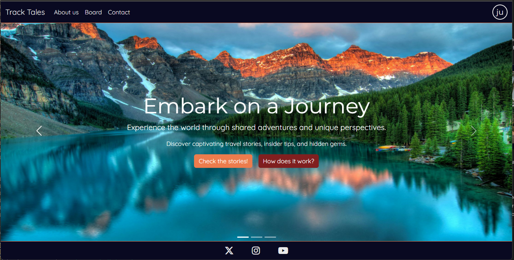
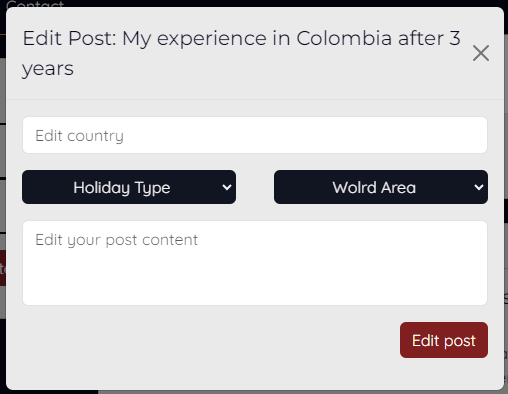
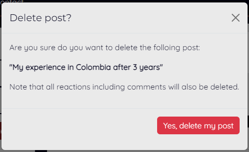

# Track Tales Community

#### /input responsive screenshot/

Explore Track Tales, a thoughtfully designed platform for seamless storytelling. Create posts with titles, rich content, and holiday tags. Personalize your profile, adding a unique touch, while geographical tags provide a global context. Interact seamlessly with likes and comments, fostering a sense of community. Join us in the beautifully crafted space of Track Tales and effortlessly share your stories.

The TrackTales community is live, to access it [click here.][ADD LINK]

## Table of contents

+ [UX](#ux)
+ [Design](#design)
+ [Features](#features)
+ [Testing](#testing)
+ [Technologies used](#technologies-used)
+ [Deployment](#deployment)
+ [Credits](#credits)

## UX

### Site Purpose
Track Tales serves as a dedicated space for individuals passionate about travel to freely share their stories. Our platform is designed to empower users, allowing them to create personalized profiles, seamlessly publish travel narratives, and engage with a community of like-minded travelers.

### Audience

Track Tales caters to travel enthusiasts and storytellers alike, providing a dedicated space for individuals passionate about sharing their unique travel experiences. This platform fosters connections among like-minded individuals who appreciate the beauty of diverse narratives from around the world, creating a vibrant community for bloggers and writers focused on the art of travel storytelling.

### Current User Goals
At Track Tales, users share their travel experiences, creating personalized profiles to showcase stories. Engaging with a global community, users explore diverse narratives, connect with like-minded enthusiasts, and manage their content effortlessly. Geographical tagging adds depth to stories, offering insights into different cultures and locations. The platform is designed to facilitate seamless storytelling and connections among individuals passionate about travel.

### Future User Goals
As Track Tales evolves, future users will likely seek a seamless space to share evolving travel experiences, connect with like-minded enthusiasts, and explore narratives that transcend geographical boundaries. The platform aims to continually enhance features, offering users intuitive tools for content management and community engagement in the realm of travel storytelling.

## Design

### Color scheme

### Typography

### Imagery

## Features

### Existing Features

#### Navbar

- In large screens the navbar displays links to home, about us, board contact and user options. 

- When the user is not logged in, an user icon is displayed and the options are sign-up or login.

- When the user is logged in, an user the two first letter of the user's username are displayed instead of the profile icon and the options are profile or logout.

- In small screens, all links but the home one, are within a burger menu. Additionally, the profile dropdown options are added in the same category as the rest of the links. 

#### Footer

- User have functional links to X, Instagram and Youtube. These links will open in a new tab as they are outside the web application. 

#### Index

- Three carousel images are displayed in the home page. 
- Inital page cotains a catchy titles and a functional link to the posts board and about us pages.

- Second page incentivates the user to create an account and provide the links to signup or login.

add screenshot

- Third page gives a small background about the applocaaton and provodes a link to "learn more" that will redirect to the about us page. 

add screenshot

#### About us 

- This is an informational page. It contains a brief description of the forum, explains what a user can do in the platform, and has a catchy content at the end. Additonally, it provies a button to redirect the user to the posts board. 

#### Contact

- This page contains a form for a user to directly contact the admin of the page. The fields are first name, last name, email, phone number, subject and message. 

- If the form is invalid, there will be error messages displayed. 

- If the form is successfully submited, it will redirect the user to a a success landing page where they have buttons to go back home, or if they are not-authenticated, they can sign up. 

#### Board 

- Create post form. Here is where the user can create a post, they can enter a title, country, dropdowns for holiday type and world area, and the content of the experience.  

- All posts need to be approved, therfore, after a post is successfully submitted a success message is displayed stating that the post has been recieved an is awaiting for approval. 

- When a user is not authenticated, they cannot create a posts. Therfore, isntead of displaying the create post form, a card is displayed explaining that they need to have an account to create posts.

- All approved posts are displayed, in the board page. A post is comprised of the user that wrote it, time since the post was created, post title, holoday type, location, country and content.

- Additionally, the post have 3-4 buttons: 
    - The post author is a link that redirects the user to to the author's profile 

    
 

    - The like button, that when a post is unlike it will show the empty heart and when is liked is shows a solid heart. It also increases or decreases the likes count. 

    

    

    - The comment button, this is a toggle button that displays a text area to comment on the post. 

    

    - When the user is not authenticated, they cannot like nor comment a post. In this case both button work as toggles to display a message that the user needs to have an account to like or comment a post.

    

    - Options button. This button is only displayed in posts where the authenticated user is the auhtor of the post. This options button is a dropdown menu that displays two options: edit post and delete post. 

    

- Comment submition. All comments need to be approved by the admin, therfore, after a comment is submitted, a success message is displayed stating that the comment is awaiting for approval.

- Comment displayed. After comments have been approved, these are displayed below the post stating the author and since when the comment was made. Here the username is also a link to the user's profile. 

- Edit post. When the authenticated user want to edit their post, a modal with the edit post form is displayed. 

- As the content needs to be reviewed, a success message is displayed when a post has been edited and that is awaiting for approval. 

- After the edited post is approved, an "(edited)" text is added in italics below the post main content to state that the post has been edited.

- Delete post. When the authenticated user clicks on the delete post option, the delete post modal is displayed to ask the user confirmation of they want to delete the post with the speicfic title. 

- When the post is deleted, a success message is displayed stating that the post has been deleted

add screenshot -> to add

- Filter posts. In large screens the filter post card is displayed on the left hand side and is sticked to the top of the page. The user can then filter posts depending on the world area or holiday type. Then the card has a clear filter button, that will clear all selected filters, and a apply filters button that will apply the filters, reload the page and only display the posts with the selected filters. 

- In smaller screens the filter card is not displayed, but a small button between the create post form and the posts is displayed. 

- When clicked, the filter button will open the filter card as a modal, for the user to successfully filter posts in small screens. 

#### Registration (Authentication)

- When not authenticated the user can create an account using a unique username and password.

- When the user tries to create an account with an exisiting username, a password that do not fulfil the requirments or if the passwords do not match, an error is displayed in the form. 

- Login page. A user can login to the application by inputing their username and correct password. 

- If, when loging in, the user inputs an incorrect username or passwrod the form will display the error. 

- Logout page. Here the application asks the user for confirmation of logging out. 

#### Create profile 

- After a user signs in for the first time, they are redirected to the create profile page. This page does not contain navigation links as its purpose is to push the user to fill their profile.

add screenshot 

- The create profile form as form validation features and display errors if a field is not field or if is filled incorrectly. 

add screenshot

- If the form is valid, the user is redirected to their user profile page where they see a success message satting that their profile has been created. 

add screenshot

#### User profile 

- The main difference between the user profile and the posts board is that the there are no posibility of filtering posts, all displayed posts are the user's and you can see a card with the user's profile information. 
- When the authenticated user is in their profile, they can create posts and also edit their profile by displauing the edit profile button. 

- If the user does not have any post, a message will be displayed stating that the user has no posts. 
- When the authenticated user is on another user's profile. They are not able to edit that user's profile as the "edit profile" button is not displayed, and they also cannot create a posts. An explanation is given and links to the board page or their profile is provided. 

- When a non-authenticated user is on a user's profile. They cannot see the user's profile information and cannot create a post either. 

- Edit profile. When the user wants to edit their profile, a modal is opened and all the fields are prefilled with the exisiting profile information. 

- If the edit profile form is successfully submitted, a success message is displayed stating tha tthe profile has been updated. 

- In the edit profile modal, there is also a delete profile button. This button will open another modal that will ask cofnrimation to the user about deleting their profile. 

- If the user decides to delete their profile they will be logged out and their posts, comments, user profile information and login credentials will be permanently deleted from the application. 

- The posts and post buttons have the same functionality describe in the [board section](#board).

### Future Features

- Asynchronous behaviour
    - When a post is liked or commented the page is automatically reloaded. A future feature is to avoid reloading the page when these actions are taken by the user. 

- Post information datamodel 
    - The idea of world areas and holiday type is good to filter and differentiate posts but furter details should be used for this. Such as country and author. 
    - The country should be another dropdown list that has the countries selected depening on the world area that has been selected.

- Further relevant feedback
    - Remove the sign in and sign out messages
    - Send notifications to users when their posts or comments have been approved
    - Send notifications when another user has commented or reacted to a post
    - Send a notificaiton when a comment is added in a post a user has commented on

## Testing

### Methodology 

Insert methodology here**

### User Stories 

#### Index page

| Testing  | Steps | Expected Outcome | Results |  
| - | - | - | - |
| Navigation bar functionality (user not authenticated) | Test that all links work | User is directed respectively to the home, about us, board, contact or account registration links | PASS |
| Navigation bar functionality (user authenticated) | Test that all links work | User is directed respectively to the navbar links and has the correct account links (profile and logout) | PASS |
| Footer links | Test that all links work and open a new tab when clicked | User is directed respectively to all social media links with  | PASS |
| Carrousel links | Test that all links work and redirect the user to the board, sing | User is directed respectively to all social media links with  | PASS |

#### About us page

| Testing  | Steps | Expected Outcome | Results |  
| - | - | - | - |
| "Start Exploring" button | Test that the links redirects to the post board | User is directed succesfully to the post board page | PASS |

#### Board

| Testing  | Steps | Expected Outcome | Results |  
| - | - | - | - |
| Filter post functionality | Test multiple filters from a single category and both categories. Clear filters button clear all selected filters.  | Post are successfully filter depending the applied filters. The clear filter button clears all selected filters. | PASS |
| Sign-in button display and functionality (user not authenticated) | The first card displayed above the displays a button to sign up, and the button redirects to sign-in form.  | Card successfully displays button and the button redirects to sign-in page | PASS |
| Like and comment buttons (user not authenticated) | When a not-authenticated user tries to like or comment on a post, a message is displayed stating that they need to login to performed any of those actions. The message contains an login link. | The buttons successfully toggle the login request message and the login link redirects to the login page. | PASS |
| Create post form (user authenticated) | The create post form is displayed with the username username at displayed at the top of the form. | When user is authenticated, the create post form is successfully displayed with the correct sign-in user at the top | PASS |
| Create post form - Form validation | Submit an empty form | The browser promts validation that all fields need to be filled. | PASS |
| Create post form - Form validation | Submit an form with an existing title. | An error message is displayed, stating that there is already a post with that title. | PASS |
| Create post form - Form validation | Submit an incomplete form. | The browser promts validation that all fields need to be filled. | PASS |
| Create post form - Form validation | Submit a complete post. | The post is successfully submited and a success message is displayed, stating that the post is awaiting review. | PASS |
| Post buttons - profile button | click on the post author name to be redirected to the author's profile. | The button successfully redirects to the correct user profile page. | PASS |
| Post buttons - Like button | When the post is not liked by the authenticated user, the heart icon should be no solid, and when it is, it should be solid. When the post is liked or unliked, the counter should add up or substract down the number of likes and change the fill of the icon. | the button successfully adds or substracts the number of likes and the heart icon changes depending on the like status for that user. | PASS |
| Post buttons - Comment button | The comment button toggles a comment field area where the user can comment in the post. | The button successfuly toggles the comment area and the submit comment button. | PASS |
| Post buttons - Options dropdown button | When the authenticated user is the author of any of the posts, an option dropdown button should be displayed in the top right corner of the card. The dropdown should display two options: edit post and delete post. | The button is successfully displayed for posts where the authenticated user is the author but is not displayed for posts where the authenticated user is not the autor. | PASS |
| Comment form - Form validation | Submit an empty comment. | The browser promts validation that all fields need to be filled. | PASS |
| Comment form - Form validation | Submit a comment. | The comment is successfully submited an a success message is displayed, stating that the comment is awaiting review. | PASS |
| Post options - Edit post | When the post options is available, the edit post button displays a edit post modal with the correspondent post title at the top and the form to edit the post. | When the authenticated user is the author, it successfully displays the edit post modal when clicking the edit post option. | PASS |
| Post options - Delete post | When the post options is available, the delete post button displays a delete post modal with the correspondent post title at the top and the a button to delete the post. | When the authenticated user is the author, it successfully displays the delete post modal when clicking the delete post option. | PASS |
| Edit post - Form validation | Submit an empty form. | An error message is displayed, stating that fields are are required. | PASS |
| Edit post - Form validation | Submit an incomplete form. | An error message is displayed, stating that all fields are are required. | PASS |
| Edit post - Form validation | Submit an valid form. | A success message is displayed, stating that the post was successfully received and is awating for approval. | PASS |
| Delete post functionality | Click on delete post. | The post is successfully deleted and a success message is displayed confirming tha the post has been deleted. | PASS |
| Edit post display | After a post has been edited and approved, (edited) should be displayed in italics. | The (edited) message is successfully displayed below the post content after this is edited an approved. | PASS |

#### Contact 

| Testing  | Steps | Expected Outcome | Results |  
| - | - | - | - |
| Contact form - Form Validation | Submit empty form | Browser promts that required fields need to be filled | PASS |
| Contact form - Form Validation | Submit empty form (after filling and deleting the field's content) | Browser promts that required fields need to be filled | PASS |
| Contact form - Form Validation | Submit with an invalid email address | Error message is successfully displayed | PASS |
| Contact form - Form Validation | Submit valid form | User is redirect to success page stating that the response has been recorded | PASS |
| Contact form success links | Test the Sign up and home links functionality | User is successfully redirected to signup or home page | PASS |

#### Registration 

| Testing  | Steps | Expected Outcome | Results |  
| - | - | - | - |
| User sign-up page  | Page should display the sign up form. | User is successfully directed to the signup page and sees the signup form. | PASS |
| User sign-up - Form validation  | Submit an empty form. | Browser promts that required fields need to be filled. | PASS |
| User sign-up - Form validation  | Submit an incomplete form. | Browser promts that required fields need to be filled. | PASS |
| User sign-up - Form validation  | Submit an invalid password. | Form promts the errors in the password. | PASS |
| User sign-up - Form validation  | Submit non-matching invalid password. | Form promts the error. | PASS |
| User sign-up - Form validation  | Submit an exisiting user name. | Form promts that the username is already taken error. | PASS |
| User login page  | Page should display the login form. | User is successfully directed to the login page and sees the login form. | PASS |
| User login page - Form validation | Submit an incorrect username password. | Form promts that the username and/or password is not correct. | PASS |
| User logout page  | Page should display the logout form. | User is successfully directed to the logout page and sees the logout form. | PASS |
| User logout page - Form validation | Click in logout. | User is successfully logged out and a display message is displayed at the top. | PASS |

#### Create profile

| Testing  | Steps | Expected Outcome | Results |  
| - | - | - | - |
| Create profile page redirection  | When a new user signs up for the website, it should be redirected to the create profile page. | A new user is successfully redirected to the create profile page that displays the create profile form. | PASS |
| Create profile - Form validation | Submit an empty form. | Browser promts that required fields need to be filled. | PASS |
| Create profile - Form validation | Submit an empty form. | Browser promts that required fields need to be filled. | PASS |
| Create profile - Form validation | Submit an incomplete form. | Browser promts that required fields need to be filled. | PASS |
| Create profile - Form validation | Submit letters in the countries visited field. | Error message is displayed that this field should be a number. | PASS |
| Create profile - Form validation | Submit a valid form. | User is redirected to their profile and a success message is displayed. | PASS |
| Create profile - Form validation | No submition and go to user profile manually by chaning the browser link. | User can see their profile with the default values and the success message of created profile is not displayed. | PASS |

#### User profile

| Testing  | Steps | Expected Outcome | Results |  
| - | - | - | - |
| Profile display - Authenticated user profile  | When the authenticated user navigates to their profile and should display the edit profile button. | The authenticated user successfully sees their profile information and the edit profile button. | PASS |
| Profile display - Authenticated user navigating another user's profile  | When the authenticated user navigates to another user profile should be able to see the users profile information without being able to edit their profile. | The authenticated user successfully sees other user profile and their profile information. | PASS |
| Profile display - Non authenticated user navigates to a user profiles  | When a non-authenticated user navigates to a user's profile they are not able to see the user's profile information besides the username and display name. The profile card should display a a login link. | The non-authenticated user cannot see the user information and the login link successfully redirects to the login page. | PASS |
| Profile display - Non authenticated user navigates to a user profiles  | When a non-authenticated user navigates to a user's profile they are not able to see the user's profile information besides the username and display name. The profile card should display a a login link. | The non-authenticated user cannot see the user information and the login link successfully redirects to the login page. | PASS |
| Edit profile button | When the authenticated user is in their profile, the "edit profile" button should open the edit profile modal. | When clicking the edit profile button, the edit profile modal is successfully displayed with the field's prefilled with the exisiting information. | PASS |
| Edit profile form - Form validation | Submit an empty form. | Browser promts that required fields need to be filled. | PASS |
| Edit profile form - Form validation | Submit an incomplete form. | Browser promts that required fields need to be filled. | PASS |
| Edit profile form - Form validation | Submit a valid form. | The profile is successfully updated an a success message is displayed to provide feedback to the user. | PASS |
| Delete profile | When a user clicks on delete profile, they have a button for delete profile that shoud open a delete profile confirmation modal. | The delete profile is successfully displayed. | PASS |
| Delete profile - Functionality | when the user confirms that they want to delete their profile, they should be logged in and their records deleted from the database. | The delete profile feature successfully logs out the user and deletes the user from the databse. | PASS |
| Post form display - Authenticated user's profile | When the authenticated user is in their profile they are able to create posts. | The post form is successfully displayed for the authenticated user to create a post from their profile page. | PASS |
| Post form display - Authenticated user in another user's profile | When the authenticated user is in another user's profile they cannot create posts but the there are links explaing where they can create them. | The post form is not displayed and a card with the board and profile buttons is displayed. Both the board and the user profile links are wired correctly. | PASS |
| Post form display - Non-authenticated user in a user's profile | When a non-authenticated user is in another user's profile no card is displayed above the exisiting user's posts. | The post form is not displayed. | PASS |
| Posts display - User with existing posts | All user posts should be displayed when navigating to their profile. | All user posts are successfully displayed. | PASS |
| Posts display - User with no existing posts | When navigating to a user's profile without posts, a message should be displayued stating that the user's profile do not have any posts. | Message is displayed succeessfuly for when an user do no have any posts. | PASS |

### Testing user sotries from UX section 

#### Current user goals

#### Future user goals

## Technologies used

### Programming languages

- HTML5
- CSS3
- JavaScript (jQuery)
- Python (Django)

### Frameworks, Libraries and programs used

- Google Fonts 
- Bootstrap
- Github
- CodeAnywhere
- Heroku
- cloudinary
- dj-database-url
- dj3-cloudinary-storage
- Django
- django-allauth
- guinicorn
- psychopg2

## Deployment

## Credits

### Design

### Code

### Media
